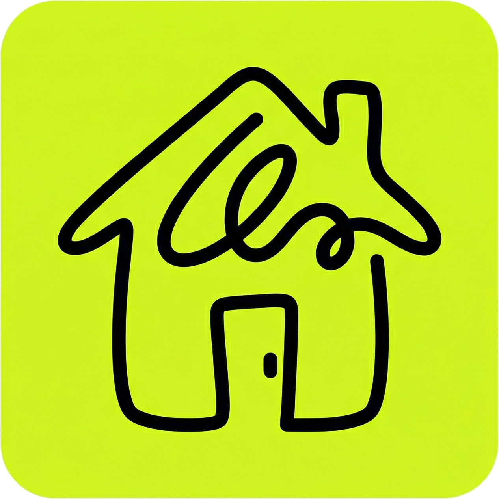
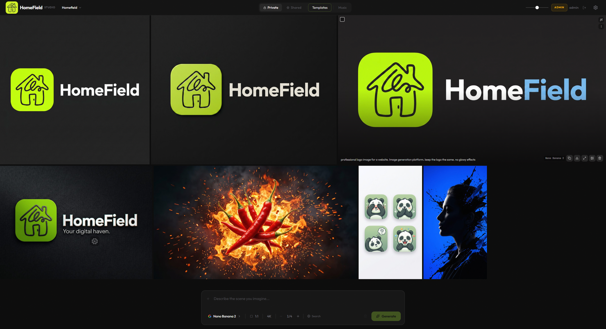
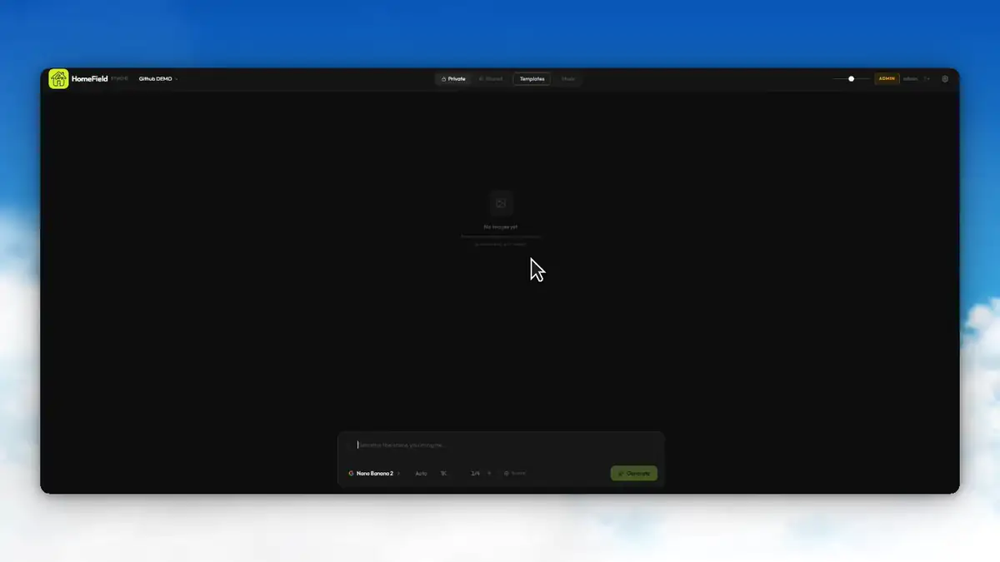
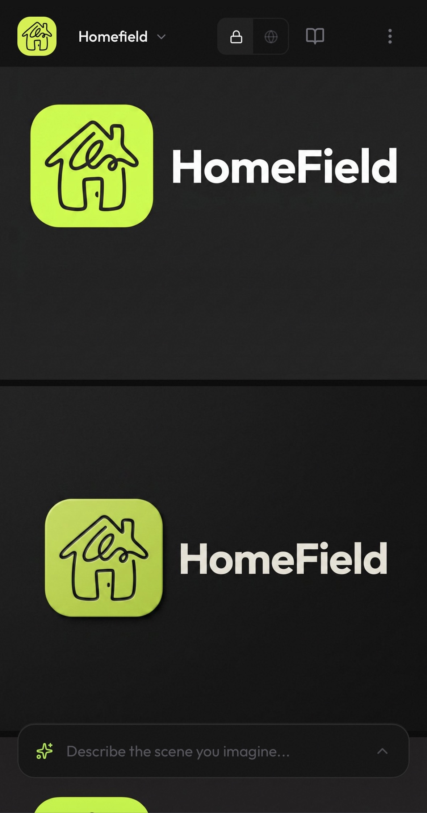
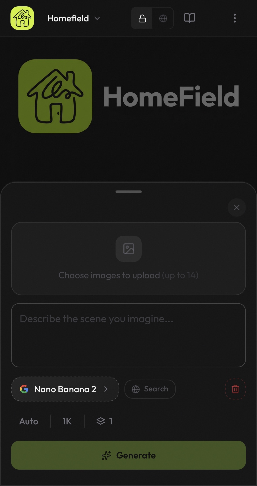

<div align="center">



# HomeField Studio

[](https://github.com/Stink-O/Homefield/stargazers)
[](https://github.com/Stink-O/Homefield/commits/master)
[](https://github.com/Stink-O/Homefield/pkgs/container/homefield)
[](LICENSE)

⭐ If you like this project, star it on GitHub — it helps a lot!

[Features](#features) • [Prerequisites](#prerequisites) • [Quick Start](#quick-start) • [Self-Hosting](#self-hosting-with-docker) • [Local Development](#local-development) • [Roadmap](#roadmap)

</div>

---

A self-hosted AI studio for image and music generation, built on Google Vertex AI. No subscription, no per-generation fees, nothing leaves your network. Clone the repo, run the setup script, and you have a private creative studio running on your own hardware.

If you've used [Higgsfield](https://higgsfield.ai) or [Adobe Firefly](https://firefly.adobe.com), it's the same gallery-first experience — except you own the server, pay nothing per image, and your prompts never touch anyone else's infrastructure.





<details>
<summary>Mobile screenshots</summary>
<br>
<table>
  <tr>
    <td></td>
    <td></td>
  </tr>
</table>
</details>

---

## Features

### Image generation

- **Models:** Nano Banana 2 (fast) and Nano Banana Pro (flagship)
- **Reference images:** attach up to 14 per prompt to guide style or composition
- **Aspect ratios:** Auto, 1:1, 2:3, 3:2, 3:4, 4:3, 4:5, 5:4, 9:16, 16:9, 21:9
- **Resolution:** 1K, 2K, or 4K output
- **Batch generation:** run multiple generations from the same prompt at once
- **Search grounding:** optionally anchor generations in live web context

### Music generation

- **Text-to-music** via Google Lyria
- **Duration:** 30s, 60s, 3 min, 4 min
- **Controls:** BPM, intensity, instrumental toggle, custom lyrics, watermark
- **Models:** Lyria 3 Pro Preview and Lyria 3 Clip Preview

### Organisation

- **Project workspaces** to separate generations by project or client
- **Prompt template library** with categories, favourites, and "For You" recommendations based on your history
- **Cross-device sync** so everything follows your account across devices and tabs

### Collaboration

- **Live pending states:** generations started anywhere show up on every open session in real time
- **Shared gallery** for broadcasting to a public live feed
- **Multi-user support** with admin-controlled account approval
- **Admin panel** for managing users, roles, and backups

---

## Prerequisites

- **Docker and Docker Compose** — [install Docker](https://docs.docker.com/get-docker/)
- **A Google Cloud project** with the [Vertex AI API](https://console.cloud.google.com/apis/library/aiplatform.googleapis.com) enabled
- **A service account JSON key** with the **Vertex AI User** role

> [!NOTE]
> No GPU required — all generation runs on Google's infrastructure.

---

## Quick Start

Paste this into any AI agent (Claude, ChatGPT, Gemini, etc.) and it will walk you through the entire setup:

```
I want to self-host HomeField Studio, an AI image and music generation web app that runs on Google Vertex AI. Help me get it running from scratch.

Work through these steps in order, confirm each one is done before moving on, and ask me for any information you need along the way:

1. Check that Docker and Docker Compose are installed. If not, help me install them.

2. Clone the repo:
   git clone https://github.com/Stink-O/Homefield.git
   cd Homefield

3. Help me set up a Google Cloud project with the Vertex AI API enabled. If I already have one, use that.

4. Create a service account with the "Vertex AI User" role, download a JSON key, and help me strip all the newlines out of it so it's a single line.

5. Run the setup script and help me fill in each prompt:
   bash setup.sh

   Or if I'd rather do it manually, help me create homefield.env in the repo root with:
   AUTH_SECRET        (generate with: openssl rand -base64 32)
   AUTH_TRUST_HOST=true
   AUTH_URL           (the URL I'll access the app from, e.g. http://192.168.1.100:3000)
   GOOGLE_APPLICATION_CREDENTIALS_JSON  (the single-line JSON key from step 4)
   GENERATION_PROVIDER=vertex
   NODE_ENV=production

   Then start it:
   docker compose -f docker-compose.homelab.yml up -d

6. Once the app is running, open it in a browser. You'll be directed to /setup to create the first admin account — just fill in a username, email, and password.

Let me know when everything is up and I can log in.
```

> [!TIP]
> The agent handles Google Cloud setup, credentials, Docker configuration, and first login end-to-end.

---

## Self-Hosting with Docker

```bash
git clone https://github.com/Stink-O/Homefield.git
cd Homefield
bash setup.sh
```

The setup script handles configuration, pulls the image, and starts the container.

### Manual setup

Create `homefield.env` in the repo root:

```env
AUTH_SECRET=           # openssl rand -base64 32
AUTH_TRUST_HOST=true
AUTH_URL=              # e.g. http://192.168.1.100:3000
GOOGLE_APPLICATION_CREDENTIALS_JSON=   # service account JSON as a single line
GENERATION_PROVIDER=vertex
REPLICATE_API_TOKEN=   # only needed if GENERATION_PROVIDER=replicate
NODE_ENV=production
```

Then start it:

```bash
docker compose -f docker-compose.homelab.yml up -d
```

### Auto-updates

Every push to `master` publishes a new image to `ghcr.io/stink-o/homefield:latest`. [Watchtower](https://containrrr.dev/watchtower/) will pick it up and restart the container automatically.

---

## Local Development

```bash
git clone https://github.com/Stink-O/Homefield.git
cd Homefield/web
cp .env.example .env.local
npm install
npm run dev:http
```

Open `http://localhost:3000`. For HTTPS in dev, drop `cert.pem` and `key.pem` in `web/` (use [mkcert](https://github.com/FiloSottile/mkcert)) and run `npm run dev` instead.

### Environment variables

| Variable | Required | Description |
|---|---|---|
| `AUTH_SECRET` | Yes | Generate with `openssl rand -base64 32` |
| `AUTH_TRUST_HOST` | Yes | Set to `true` |
| `AUTH_URL` | Yes | Full URL the app is served from |
| `GOOGLE_APPLICATION_CREDENTIALS_JSON` | Yes | Service account JSON as a single line |
| `GENERATION_PROVIDER` | No | `vertex` (default) or `replicate` |
| `REPLICATE_API_TOKEN` | No | Only needed if using Replicate |

### Google credentials

1. Enable the **Vertex AI API** in [Google Cloud Console](https://console.cloud.google.com)
2. Create a service account with the **Vertex AI User** role and download the JSON key
3. Remove all newlines from the file so it's one line, paste it as `GOOGLE_APPLICATION_CREDENTIALS_JSON`

---

## First Login

When you open HomeField for the first time, you'll be directed to `/setup` to create the initial admin account. Fill in a username, email, and password — that's it. The setup page disables itself once an admin exists.

After that, new accounts require admin approval before they can generate anything. Everything is managed from the Admin panel in the app.

---

## Tech Stack

| Layer | Technology |
|---|---|
| Framework | Next.js 16 (App Router) |
| Language | TypeScript 5 |
| Styling | Tailwind CSS 4 |
| Animation | Framer Motion |
| AI (Image and Music) | Google Vertex AI (Gemini, Imagen, Lyria) |
| AI (Fallback) | Replicate |
| Database | SQLite via Drizzle ORM + better-sqlite3 |
| Auth | NextAuth v5 |
| Real-time | Server-Sent Events (SSE) |
| Image processing | Sharp |
| Audio waveforms | Wavesurfer.js |

---

## Roadmap

- [ ] Video generation
- [ ] Prompt chaining and multi-step workflows
- [ ] Local model support (Ollama / ComfyUI)
- [ ] Shareable prompt packs
- [ ] Native mobile app
